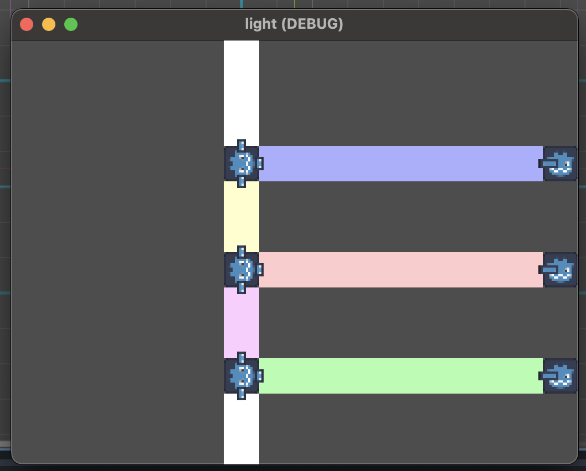

# light game

a small test game i made for fun! theres different parts that you can use to bounce and manipulate light in different ways to solve puzzles! sadly the puzzles are all very easy because i do not know how to make puzzles.

to run, clone the project, open it in godot, and hit play!
